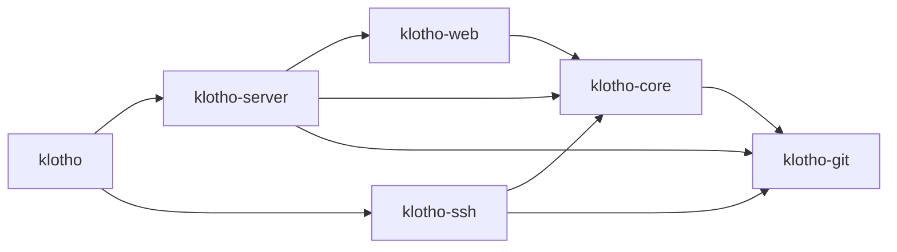

# Klotho roadmap

This is the build plan for Klotho: the packages to use, how to lay out the repository, and the order to build things in. Each phase has a goal, what to build, the requirements it satisfies, the new packages it brings in, a **Done when** checklist you can test, and notes on the traps to watch for.

Background:
- [docs/README.md](docs/README.md): the index of requirements and research.
- [ADR 0001](docs/decisions/0001-stack.md): why the stack is what it is.
- [ADR 0002](docs/decisions/0002-topcoat-ui.md): why the UI is server-rendered with Topcoat (replaces the SvelteKit SPA).
- [ADR 0003](docs/decisions/0003-data-and-file-storage.md): the data directory, and why only non-git files can go to S3.
- [ADR 0004](docs/decisions/0004-native-git-transport.md): why Klotho does all git work in-process with gitoxide and never runs the `git` program.
- [API endpoints](docs/design/api-endpoints.md) and [auth flows](docs/design/auth-flows.md): the designs the phases implement.

Versions are the latest at the time of writing (2026-09-30). Check crates.io (and the Mermaid release) when you add each one.

---

## 1. Repository layout

The target layout, reached during Phase 0:

```text
klotho/
├── Cargo.toml                  # workspace only: [workspace], shared deps and lints, no [package]
├── Cargo.lock
├── README.md  ROADMAP.md  LICENSE
├── klotho.example.toml         # every config key, with defaults and comments (NFR-OPS-013)
├── klotho.dev.toml             # development config: data_dir = "testRepos", debug logging
├── deny.toml                   # cargo-deny: licences and vulnerable crates (NFR-SEC-051)
│
├── crates/
│   ├── klotho/                 # the binary. main.rs + CLI (clap): `klotho serve`, `klotho admin …`
│   ├── server/                 # klotho-server. HTTP: the outer axum app. Mounts klotho-web as its fallback
│   │   └── src/
│   │       ├── lib.rs          #   build_app(state) -> Router
│   │       ├── api/            #   /api/v1 handlers, one module per area (repos.rs, user.rs…)
│   │       ├── oauth.rs        #   /-/oauth provider endpoints (Phase 8)
│   │       ├── git_http.rs     #   smart HTTP, driving klotho-git's protocol engine (Phase 1b)
│   │       ├── assets.rs       #   /-/assets/*: the embedded Topcoat bundle (FR-UI-052)
│   │       ├── bearer.rs       #   Authorization: Bearer -> Actor extractor (the API's only auth)
│   │       └── error.rs        #   ApiError -> JSON {code, message} (FR-API-030)
│   ├── web/                    # klotho-web. The web UI: Topcoat pages and components, rendered on the server
│   │   ├── src/
│   │   │   ├── lib.rs          #   router(state) -> topcoat Router (app context, sessions, assets)
│   │   │   ├── app/            #   pages; the module tree is the URL tree (Topcoat module routing)
│   │   │   ├── components/     #   Topcoat UI components (copied in, ours to edit) + our own
│   │   │   └── session.rs      #   current_user(cx), require_sudo(cx)
│   │   ├── assets/             #   vendored JS (mermaid.esm.min.mjs, passkey.js), icons, images
│   │   ├── styles.css          #   Tailwind entry + theme (written by `topcoat ui init`)
│   │   └── components.toml     #   which Topcoat UI components are installed
│   ├── core/                   # klotho-core. Domain and data: no HTTP in here
│   │   ├── src/
│   │   │   ├── names.rs        #   RepoName / OwnerName: display + key (today's git/src/name.rs)
│   │   │   ├── authz.rs        #   authorize(actor, resource, action), the one permission check (FR-ACL-050)
│   │   │   ├── repos.rs        #   create / rename / delete services (DB + storage together)
│   │   │   ├── users.rs, auth/ #   passwords, tokens, passkeys, TOTP, OIDC logic
│   │   │   ├── files.rs        #   FileStore: local or S3 via object_store (ADR 0003)
│   │   │   └── db/             #   sqlx queries
│   │   └── migrations/         #   sqlx migrations
│   ├── git/                    # klotho-git. Repositories on disk via gix: RepoStore, reads, the protocol engine (ADR 0004)
│   └── ssh/                    # klotho-ssh. russh server that hands off to klotho-git (Phase 4)
│
├── xtask/                      # `cargo xtask dist`: the two-pass release build (ADR 0002)
│
├── tests/                      # end-to-end tests: start the real binary, run real `git clone/push`
└── docs/
```

Folders are short; package names keep the `klotho-` prefix. A bare `core` would clash with Rust's built-in `core` library, `git` is easily confused with the `git` program and `gix`, and generic names can collide with dependencies or on crates.io.

**Dependency direction.** Arrows point at what a crate may use. Never the other way.



- **`klotho-git` knows nothing about users, names or HTTP.** Once storage is ID-based (Phase 1), it takes a repository ID or path, never a name. That's why `name.rs` moves to `klotho-core`.
- **`klotho-core` knows nothing about HTTP.** It returns domain errors, and `klotho-server` and `klotho-web` map them to status codes and pages. The SSH server reuses exactly the same `authorize()` and services.
- **`klotho-web` is the only crate that knows about Topcoat.** It gets everything through public `klotho-core` services, never through raw SQL or `klotho-git`. That keeps API parity possible (FR-API-004), and if we ever leave Topcoat, only this crate gets rewritten.
- **Why not more crates?** Splitting `klotho-core` into `-db` and `-auth` is easy later if compile times hurt. Six crates are enough to enforce the boundaries that matter.

**Moved from the original layout (done 2026-10-01):**

| Was | Now |
|---|---|
| `src/main.rs` | `crates/klotho/src/main.rs`. Building the router moved to `klotho_server::build_app` |
| `src/api.rs`, `src/error.rs` | `crates/server/src/api.rs`, `error.rs`. `api.rs` splits into `api/` modules as it grows |
| `src/smart_http.rs` | `crates/server/src/git_http.rs` |
| `git/` (crate `git`) | `crates/git/` (crate `klotho-git`) |
| `git/src/name.rs` | Still in `klotho-git`. Moves to `crates/core/src/names.rs` in Phase 1 |

---

## 2. Packages

### Backend (Rust)

| Crate | Version | Used for | Phase |
|---|---|---|---|
| `tokio` | 1.x (have) | Async runtime | — |
| `axum` | 0.8.9 (have) | HTTP routing | — |
| `tower-http` | 0.7.1 | Middleware: `TraceLayer`, `TimeoutLayer`, `RequestBodyLimitLayer`, request IDs, compression | P0 |
| `tracing`, `tracing-subscriber` | (have) | Logging; turn on the `json` feature in P10 | — |
| `clap` | 4.6.7 | CLI (`serve`, `admin …`) | P0 |
| `figment` | 0.10.19 | TOML config with environment overrides (features `toml`, `env`) | P0 |
| `serde`, `serde_json`, `thiserror`, `anyhow` | (have) | — | — |
| `gix` | 0.88.0 (have 0.87) | Reading repositories | — |
| `sqlx` | 0.9.0 | Database: `sqlite-bundled` (not `sqlite`, which also enables loading extensions), `runtime-tokio`, `macros`, `migrate` (PostgreSQL later) | P1 |
| `jiff` | 0.2.37 | Timestamps with UTC offsets, RFC 3339 output (FR-API-011) | P1 |
| `sha2` | 0.11.0 | Storage path hashes, token hashes | P1 |
| `tempfile` | 3.27.0 | Atomic repository creation: initialise in a temp dir, then rename (FR-STOR-005) | P1 |
| `object_store` | 0.14.2 | `FileStore` for non-git files: the local backend first, then the `aws` feature for S3-compatible storage (ADR 0003) | P3 (local), P9 (S3) |
| `argon2` | 0.6.0 | Password hashing | P2 |
| `rand` | 0.10.3 | Tokens (PATs, one-time tokens). Session tokens come from `topcoat::session` | P2 |
| `base64` | 0.23.1 | Base64url encoding of tokens | P2 |
| `crc32fast` | 1.5.2 | PAT checksum | P2 |
| `secrecy` | 0.10.3 | Keeps secrets out of `Debug` output and logs (NFR-OPS-023) | P2 |
| `utoipa`, `utoipa-axum` | 6.0.0, 0.3.0 | OpenAPI generated from handlers (FR-API-005), for external clients | P3 |
| `rust-embed` | 8.12.0 | Embedding the Topcoat asset bundle in the binary, when `KLOTHO_ASSETS_DIR` is set at build time | P0 |
| `mime_guess` | 2.0.5 | Content types for embedded assets | P0 |
| `comrak` | 0.55.0 | Markdown (GFM) → HTML | P3 |
| `ammonia` | 4.2.0 | HTML sanitising after comrak (NFR-SEC-011) | P3 |
| `syntect` | 5.3.0 | Server-side syntax highlighting (FR-UI-003) | P3 |
| `russh` | 0.63.3 | SSH server | P4 |
| `webauthn-rs` | **0.5.5** | Passkeys. Use the stable 0.5 line, not the `0.6.1-dev` pre-release | P5 |
| `totp-rs` | 6.0.0 | TOTP 2FA | P5 |
| `openidconnect` | 4.0.1 | SSO sign-in (brings in `oauth2` 5) | P5 |
| `lettre` | 0.11.23 | Email: magic links, resets, notifications | P5 |
| `chacha20poly1305` | 0.11.0 | Encrypting stored secrets such as TOTP seeds and client secrets (NFR-SEC-042) | P5 |
| `tower_governor` | 0.8.0 | Rate limiting (NFR-SEC-021), as an axum layer that also covers the UI | P5 |
| `reqwest` | 0.13.5 | Outgoing HTTP: webhooks, mirrors (with an SSRF-safe resolver) | P6 / P8 |
| `globset` | 0.4.20 | Branch and tag protection patterns (FR-ACL-040, 042) | P7 |
| `hmac` | 0.13.0 | Webhook signatures (FR-INT-002) | P8 |
| `jsonwebtoken` | 11.1.0 | Signing ID tokens when Klotho is the OIDC provider (FR-AUTH-035) | P8 |
| `metrics`, `metrics-exporter-prometheus` | 0.24.6, 0.18.3 | `/-/metrics` | P10 |
| `tantivy` | 0.26.2 | Code search (later) | later |
| `ldap3` | 0.12.1 | LDAP sign-in (nice-to-have) | later |

**Deliberately left out:**
- **`tower-sessions` + `tower-sessions-sqlx-store`.** `topcoat::session` already issues the cookie and hands us the token hash, and our own `sessions` table fits the design exactly (hashed IDs, sudo mode). Also, the store 0.15 still depends on sqlx 0.8, and linking two sqlx versions with SQLite fails to build.
- **`axum-extra` cookies.** The API is bearer-only, and Topcoat handles the UI's cookies.
- **`samael` (SAML).** It's at 0.0.x. Use an OIDC bridge instead (FR-AUTH-038).

### Frontend (`crates/web`, no npm)

| Package | Version | Used for | Phase |
|---|---|---|---|
| `topcoat` | **=0.9.0** (pinned) | Pages, components, sessions, cookies, origin check, assets. Features: default + `tailwind`, `ui`, `font-fontsource`. Also a `[build-dependencies]` entry with `tailwind` | P2 (login page), P3 |
| Mermaid | 12.0.0 | `mermaid.esm.min.mjs` from the npm tarball's `dist/`, vendored in `assets/` and declared with `asset!()`. Loaded only on diagram pages | P8 |
| Passkey script | ours | About 50 lines around `navigator.credentials` with `PublicKeyCredential.parse*OptionsFromJSON()`. Replaces `@simplewebauthn/browser` | P5 |
| CodeMirror | — | Only if P9 needs an editor; the diff and code views are server-rendered with `syntect`. P9 decides how to bundle it | P9 |

Styling is Tailwind (through Topcoat, no Node) with Topcoat UI components copied in by `topcoat ui add`. Once copied they're our code: edit them freely.

**Upgrading Topcoat.** It's experimental and makes breaking changes. Upgrade one minor version at a time, in its own PR, and read the changelog first. The origin-check test and the `cargo xtask dist` check in CI exist to catch silent breakage. Upgrade `topcoat-cli` to the same version at the same time: the CLI's bundle format has to match the crate's.

### Tools

| Tool | Install | Why |
|---|---|---|
| `sqlx-cli` | `cargo install sqlx-cli --version 0.9.0 --no-default-features --features sqlite --locked` | `sqlx migrate add -r` for new migrations, and `cargo xtask sqlx-prepare` (which runs `cargo sqlx prepare`) after any query or migration change. Only needed when changing queries; building uses the committed `.sqlx/` |
| `cargo-deny` | `cargo install cargo-deny` | Licence and security checks in CI |
| `bacon` | `cargo install bacon` | Re-runs check, test or clippy on every save |
| `topcoat-cli` | `cargo install topcoat-cli --version 0.9.0 --locked` | `cargo xtask dev` and `cargo xtask dist` run it. Also `topcoat ui add` and `topcoat fmt` for `view!` blocks. Keep its version equal to the `topcoat` crate's |
| `cargo-fuzz` | `cargo install cargo-fuzz` | Fuzz targets for the git protocol parsers (Phase 1b). Needs a nightly toolchain |

---

## 3. Phases

Phases run in order: 0, 1, 1b, 2 and onwards. Phase 1b (the native git transport) was added on 2026-10-01 with ADR 0004 and kept its own number so the phase numbers used across the docs stay valid. The first milestone that matters is **after Phase 5: good enough for a small team to use for real.** Everything after that adds breadth.

### Phase 0: Groundwork

**Goal:** restructure, and fix the things that are cheap now and painful later.

**Status:** done (2026-10-01).

- ~~Move to the workspace layout above, and rename crate `git` → `klotho-git`.~~
- ~~Config: a `figment` TOML file plus `KLOTHO_SECTION__KEY` environment overrides, with `#[serde(deny_unknown_fields)]`. Ship `klotho.example.toml`.~~ The config types live in `klotho-core::config`. Loading lives in the binary. A test checks that the example file sets every key to its default.
- ~~**One data directory** (FR-STOR-012): `storage.data_dir` (default `data`) with `repositories/`, `klotho.db` and `files/` under it, each overridable. Relative paths resolve against the config file's folder, and the absolute paths are logged at startup.~~
- ~~`klotho.dev.toml` with `data_dir = "testRepos"`.~~ `.cargo/config.toml` now sets only `KLOTHO_CONFIG`, so `cargo run` uses it.
- ~~CLI with `clap`: `klotho [serve]` (the default) and an empty `klotho admin`.~~
- ~~Graceful shutdown: on Ctrl-C or SIGTERM, stop accepting connections and wait up to `server.shutdown_grace_secs` for running requests and git tasks (a `TaskTracker`).~~
- ~~A git version check at startup (≥ 2.39).~~ Interim: it goes away with the subprocess transport ([ADR 0004](docs/decisions/0004-native-git-transport.md)).
- ~~`tower-http` layers: tracing (path only, never the query string), request IDs (an incoming `X-Request-Id` is kept), a timeout on everything except git transport, a body limit on `/api`. Unknown `/api` paths get a JSON 404.~~
- ~~`/-/health`.~~
- ~~CI (GitHub Actions): `cargo fmt --check`, `clippy -D warnings` and `cargo test` on Linux and Windows; `cargo deny check`; `cargo xtask dist`.~~
- ~~**Topcoat spike:** `klotho-web` with a hello page, mounted as axum's fallback, and `cargo xtask dist` producing one binary that serves its CSS from `/-/assets/`.~~ `cargo xtask dev` runs `topcoat dev` with the dev config.

**Requirements:** NFR-OPS-003, 010, 011, 012, 022 (health), 030; NFR-SEC-020 (partly).

**Done when:**
- [x] `cargo test` passes from the workspace root and covers all crates.
- [x] A config file with a typo'd key refuses to start and names the key.
- [x] Starting from another folder with the same config file uses the same data directory, and the startup log shows its absolute path.
- [x] Shutdown during a running git request lets it finish (`crates/server/tests/app.rs`, over real TCP), and gives up after the grace period.
- [x] Starting with a missing or too-old `git` prints a clear error and exits non-zero.
- [x] The `cargo xtask dist` binary, copied alone to an empty directory, serves the hello page with its stylesheet. `xtask` checks this itself on every run, including in CI.

> **Guide notes (what we learned).**
> - **The asset manifest check from ADR 0002 couldn't be built as planned.** `topcoat asset bundle` always rebuilds before scanning and has no `--features` flag, so it can't scan the final, embedded binary. `cargo xtask dist` starts the final binary instead and fetches the page and its stylesheet. A wrong asset ID would make the page fail to render, so this catches the same breakage.
> - **The second build pass must not change `klotho-web`'s build in any way.** `tailwind::stylesheet!()` is `asset!(concat!(env!("OUT_DIR"), …))`, and asset IDs hash the path, so anything that changes `klotho-web`'s `OUT_DIR` changes every asset ID. That includes any Cargo feature anywhere in the build, because features unify across dependencies (learned the hard way in Phase 1). Embedding is switched on by `KLOTHO_ASSETS_DIR` through `klotho-server`'s `build.rs`, which sets a crate-local `cfg(embed_assets)`.
> - **`topcoat dev` passes `HOST`/`PORT` and waits for a readiness message.** Klotho uses them only when `TOPCOAT_DEV_URL` is set, and `klotho_server::serve` calls `klotho_web::notify_dev_server` after binding. `cargo topcoat dev` (the cargo subcommand form) is broken in 0.9.0, so use `topcoat dev` or `cargo xtask dev`.
> - **The workspace's `topcoat` entry sets `default-features = false`.** Workspace dependencies can't turn default features off per crate, and `build.rs` needs Topcoat without them.
> - **Formatting:** `rustfmt.toml` pins `max_width = 110` with `use_small_heuristics = "Max"`, the closest match to the code as it was written.

### Phase 1: Metadata store and repository identity

**Goal:** repositories get real identities. This fixes most naming and storage conflicts.

**Status:** done (2026-10-01).

- ~~SQLite via `sqlx`, migrations embedded with `sqlx::migrate!()`, and `/-/ready`.~~ WAL mode, `foreign_keys=ON`, a 5 s busy timeout. `.sqlx/` holds the offline query cache; regenerate it with `cargo xtask sqlx-prepare`.
- ~~Tables: `owners` (users and organisations share it), `users`, `repositories` and `repo_redirects` (used in Phase 6).~~ `AUTOINCREMENT`, so IDs are never reused.
- ~~`names.rs` in `klotho-core`: `RepoName` and `OwnerName` keep the display form and derive the key, with `parse_new()` and `parse_lookup()`.~~ Owner names also reject the FR-NAME-032 and 033 reserved names.
- ~~ID-based storage in `klotho-git`: `<data_dir>/repositories/<h[0:2]>/<h[2:4]>/<h>.git` with `h = hex(sha256(id))`.~~ `klotho-git` no longer knows names.
- ~~Atomic create.~~ The repository is initialised in `<root>/.tmp/` and renamed into place.
- ~~Owner-scoped routes: `/{owner}/{repo}` for git, and `/api/v1/repos/{owner}/{repo}` for the existing read endpoints.~~ Errors are `{"code", "message"}` (FR-API-030), and the repository resource has the FR-API-010 fields, with URLs built from the new `server.public_url` setting (NFR-SEC-001).
- ~~`klotho admin adopt` / `unadopted` and `GET`, `POST`, `DELETE /api/v1/admin/unadopted/…`.~~ Also `klotho admin create-user`, `POST /api/v1/admin/users`, `POST /api/v1/admin/users/{username}/repos` (Gitea's shape) and `GET /api/v1/users/{username}/repos` (paged). See [api-endpoints.md](docs/design/api-endpoints.md).

**Requirements:** FR-NAME-001–008, 010–012, 020–022, 030–034, 040, 041; FR-STOR-001, 003–008, 010, 020, 021 (create and adopt); FR-REPO-001 (without auth), 002, 035; FR-API-001, 003, 010, 030; NFR-PERF-011.

**Done when:**
- [x] Creating `MyRepo` returns `"name": "MyRepo"`, and cloning `myrepo.git` works (`crates/server/tests/git.rs`, with the real git client).
- [x] 50 parallel creates of the same name: exactly 1 succeeds, 49 get `repo_exists` (`409` over HTTP), and no stray directories are left. Tested on the service the HTTP handler calls (`repos::tests`).
- [x] `con`, `nul`, etc. push and clone fine on Windows, because the path is a hash.
- [x] `demo.git` as a new name gets `400` with code `name_invalid`.
- [x] A repository from the old flat layout (`<root>/legacy.git`) can be adopted and cloned.

> **Guide notes (what we learned).**
> - **A crash between creating the directory and committing the row leaves a directory for an ID that the next create gets again**, because the rolled-back insert also rolls back SQLite's `AUTOINCREMENT` counter. `create_repo` moves such a directory to `<root>/.orphaned/` and carries on, instead of failing forever on that ID.
> - **The `.sqlx/` cache is the only thing that lets CI build.** A query change without `cargo xtask sqlx-prepare` fails the build with "no cached data for this query", so stale caches can't slip through.
> - **`embed-assets` is no longer a Cargo feature.** Phase 1's new dependencies made the feature change `windows-sys`'s features, so `klotho-web` rebuilt in the second pass and every asset ID changed. The dist check caught it. Now `klotho-server`'s `build.rs` sets `cfg(embed_assets)` when `KLOTHO_ASSETS_DIR` is set, and both passes resolve identical dependencies.
> - **Still the old shapes:** `commits`, `tree` and `raw` moved under `/api/v1/repos/{owner}/{repo}` unchanged. Phase 3 replaces them.
> - **The startup storage check walks every repository directory** (FR-STOR-020). It's fast, but it grows with the count; see the NFR-PERF-021 note in [performance.md](docs/requirements/performance.md).

### Phase 1b: Native git transport

**Goal:** Klotho serves clone, fetch and push itself, with gitoxide, and never runs the `git` program ([ADR 0004](docs/decisions/0004-native-git-transport.md)). It comes after Phase 1 so it's built on ID-based storage, and before Phase 2 so authentication and pre-receive checks plug into our own code instead of a subprocess.

- A `protocol` module in `klotho-git` that takes a repository and a byte stream in each direction, with no HTTP or SSH in it. `klotho-server` drives it statelessly (HTTP) and `klotho-ssh` statefully (Phase 4).
- **Step 1: protocol v2 fetch.** pkt-lines with `gix-packetline`; the capability advertisement; `ls-refs` (with `ref-prefix`, `symrefs`, `peel`); `fetch` with want/have negotiation, `done`, and `side-band-64k` progress. Packs are generated with `gix-pack`'s `data::output` pipeline on the blocking pool, behind a semaphore.
- **Step 2: v0/v1 fetch** for older clients: the ref advertisement with capabilities, `multi_ack_detailed`, `no-done`, `thin-pack`, `ofs-delta`, `include-tag`.
- **Step 3: push** (`receive-pack`, v0/v1 only, because git has no v2 push): commands, quarantine directory, indexing the (thin) pack with `gix-pack`, connectivity and object checks, `report-status`, `atomic`, `push-options`, and a `gix-ref` transaction. Leave a pre-receive and a post-receive function in place, both empty for now. Phase 2 fills in pre-receive.
- **Step 4: shallow** (`deepen`, `deepen-since`, `deepen-not`, `deepen-relative`). FR-GIT-010 is must-have, because CI clones are shallow.
- **Step 5: partial clone filters** (`blob:none`, `blob:limit`, `tree:0`).
- **Switch over:** route the git HTTP paths to the engine, then delete the subprocess code in `git_http.rs`, the startup git version check and `GitVersion`, and apply ADR 0004's requirement changes.

**Requirements:** FR-GIT-001, 004–006, 010, 011, 020, 021 (hook points only), 022, 023; NFR-PERF-001–004; NFR-STOR-001, 002.

**New packages:** `gix` features for pack writing and ref transactions; `gix-packetline` (already a dependency of `gix`, check whether `gix` re-exports it); `cargo-fuzz` as a tool.

**Done when:**
- [ ] The end-to-end suite (real `git` client against the real binary, Linux and Windows) passes for: clone, fetch, push, force push, delete a branch, push tags, `--atomic` with one ref rejected, `--depth 1`, `--shallow-since`, `--filter=blob:none`, and protocol v0, v1 and v2 (`-c protocol.version=N`).
- [ ] A push of 2 GiB doesn't grow server memory (NFR-PERF-004).
- [ ] Killing the client mid-push leaves no new refs and no files outside the quarantine. The quarantine is cleaned up.
- [ ] A pushed pack missing an object the new ref needs is rejected, and the client prints our message.
- [ ] Fuzz targets for the pkt-line reader and both command parsers run in CI for a fixed time without findings.
- [ ] Clone time of the reference large repository is recorded against `git http-backend` (NFR-PERF-001). It doesn't have to meet 110% yet, but it has to be measured.
- [ ] No `std::process::Command` and no `tokio::process` remain outside tests.

> **Guide notes.**
> - **Read git's protocol docs as the spec:** `gitprotocol-pack`, `gitprotocol-v2`, `gitprotocol-capabilities`, `gitprotocol-http`. When behaviour is unclear, check what `git upload-pack` does with `GIT_TRACE_PACKET=1` on the client.
> - **Stateless HTTP negotiation** is the subtle part of v0/v1: each POST repeats all `have`s, and the server must answer as if the conversation had continued. Protocol v2 was designed around this, which is one reason to build v2 first.
> - **gitoxide's client is your test partner too.** Fetching from our server with `gix` in unit tests gives fast tests that don't need the `git` program, alongside the end-to-end tests that do.
> - **Only serve objects reachable from the refs the client was shown.** Never offer `allow-any-sha1-in-want`. Forks share pack files (Phase 6) and repositories will hold unreachable objects, so serving any object by ID would leak data between repositories.
> - Treat every byte from the client as hostile: length limits on pkt-lines (65520 bytes), caps on the number of `want`/`have` lines and on recursion in pack decoding, and timeouts per request.
> - The quarantine directory is also where size limits (NFR-SEC-020) and later quotas (Phase 10) are checked: measure the incoming pack before indexing it.

### Phase 2: Accounts and access control

**Goal:** close the critical conflict. Nobody can push without permission.

- Users and registration modes, with the first admin created by `klotho admin create-user --admin` (FR-AUTH-003).
- Passwords (Argon2id), the `sessions` table, and `topcoat::session` for the `__Host-` cookie. Login, register and logout pages in `klotho-web` (plain forms, no JavaScript needed).
- Topcoat's origin check, plus a test that keeps it on, as in [auth-flows.md](docs/design/auth-flows.md). The API ignores the cookie and accepts bearer tokens only.
- Personal access tokens: format, SHA-256 storage, scopes.
- Git HTTP Basic auth with the `401` challenge.
- `authorize(actor, repo, action)` in `klotho-core`, used by **every** handler.
- Visibility public/private, with 404 for no access.
- Rename the API to `/api/v1`, and add `/user`, `/user/tokens` (list and revoke) and `/instance`. Token creation is the `/-/settings/tokens` page.

**Requirements:** FR-AUTH-001–003, 010–013, 020, 022, 023, 040, 041, 045; FR-ACL-001, 003, 004, 007, 010, 011, 013, 030, 050; FR-REPO-010; NFR-SEC-013.

**Done when:**
- [ ] Anonymous `git push` gets a credential prompt, and a wrong token is rejected.
- [ ] A private repository gives an identical `404` to a stranger and for a repository that doesn't exist.
- [ ] A form `POST` with the session cookie but `Sec-Fetch-Site: cross-site` gets `403`.
- [ ] A request to `/api/v1/user` with only the session cookie gets `401`.
- [ ] A token without `repo:write` can clone but not push.

> **Guide notes.**
> - Write `authorize()` as a pure function over `(actor, repo_facts, action)` and unit-test it with a table of cases. It's the single most important function in Klotho.
> - Make "no access" and "not found" the same error variant *inside* core, so a handler can't accidentally tell them apart.

### Phase 3: API v1 and the web app

**Goal:** a usable browsing UI, and the read API to match it.

- `klotho-core` services for every read: contents, raw, commits (cursor pagination), branches, tags, readme, ref resolving, search. Pages and API handlers both call these.
- Every read endpoint from [api-endpoints.md](docs/design/api-endpoints.md) (Phase P3 rows), with `raw` streamed with `nosniff`, and RFC 3339 times.
- `utoipa` annotations → `/api/v1/openapi.json`.
- `klotho-web` pages: dashboard, explore, profile, repository home, tree, file, commits, commit. Run `topcoat ui init`, then `topcoat ui add` for the components you need.
- Error pages: HTML 404 (identical for "doesn't exist" and "not visible") and 500. Per-page `<title>` and Open Graph tags.
- Slow parts (last commit per tree entry) go behind `suspense` so the page streams.

- `FileStore` in `klotho-core` with the local backend only (avatars are the first user). Keys in the database, never paths.

**Requirements:** FR-API-001–005, 010–012, 020–022, 030; FR-UI-001–003, 005, 007, 010, 020, 023, 050–052; NFR-UI-002; NFR-PERF-012–015; NFR-SEC-010, 011; FR-STOR-060, 062.

**Done when:**
- [ ] `cargo xtask dist` produces one binary that serves the whole UI, with no other files next to it.
- [ ] With JavaScript disabled, you can browse a repository, open files and read history.
- [ ] Downloading a 1 GiB file through `raw` doesn't grow server memory.
- [ ] `/api/v1/nope` returns JSON 404, and `/someone/something` returns the HTML 404 page with status 404.
- [ ] Every page action added in this phase has a matching API endpoint (check the P3 rows).

> **Guide notes.**
> - Topcoat reserves `/_topcoat/…`. That name is reserved in FR-NAME-032, so enforce it in `names.rs`.
> - Keep pages thin: a page calls `current_user(cx)`, then one or two `klotho-core` services, then renders. If a page wants a query that no service offers, add the service, and the API endpoint with it.
> - `view!` blocks get long. Run `topcoat fmt`, and split components early.
> - In development, run `topcoat dev`. It rebuilds, re-bundles assets and restarts the server on every save.

### Phase 4: Git hardening and data safety

**Goal:** safe to expose to a network.

- SSH server (`russh`), user SSH keys, deploy keys. The SSH channel drives the Phase 1b protocol engine in its stateful mode.
- A push event table, recorded by the post-receive function (it feeds the thread view later).
- Engine limits: a semaphore on concurrent pack generation, a per-request time limit, and cancellation when the client disconnects (the in-process forms of NFR-SEC-022 and 023). A push size limit, checked in the quarantine.
- Archive downloads with `gix-archive`, streamed.
- Backup and restore (`klotho admin backup` / `restore`), covering repositories, the database and local files, with a test that round-trips them.

**Requirements:** FR-GIT-002, 003, 012, 024; FR-AUTH-014, 015; FR-ACL-020; NFR-SEC-020, 022, 023; NFR-STOR-010; FR-STOR-040–042.

**Done when:**
- [ ] `git clone git@host:owner/repo.git` works with a registered key, and is refused with an unknown one.
- [ ] 200 simultaneous clones: none fail, and the number of packs being built at once stays at or below the cap.
- [ ] Killing a clone client stops its pack generation within a second.
- [ ] Backup → wipe → restore gives identical refs in every repository.

> **Guide notes.**
> - **Hooks aren't the hard part any more.** With the native engine (ADR 0004), pre-receive and post-receive are function calls with the actor already known, so there are no hook scripts, no callback protocol, and no way for a hook to be told the wrong identity.
> - **Cancellation is cooperative.** Pack generation runs on the blocking pool, where dropping the future doesn't stop it. Pass a cancellation flag into the counting and encoding loops, and set it when the response body is dropped.
> - **Back up a consistent snapshot.** Pushes keep running during a backup (FR-STOR-040). Copy packs before refs: anything a copied ref points to was written before that ref, so it's already in the copy.

### Phase 5: Sign-in methods and SSO

**Goal:** modern sign-in.

- Passkeys (primary and as a second factor) with our own small passkey script, TOTP and recovery codes, the MFA ticket flow, and sudo mode (redirect to `/-/sudo`).
- Email (`lettre`): verification, password reset, magic links.
- OIDC providers, configured by an admin, with account linking rules.
- Throttling and rate limits, and the audit log.
- Session list and revoke.

**Requirements:** FR-AUTH-004–006, 016, 021, 030, 032, 033, 036, 037, 042–044; NFR-SEC-021, 042, 050.

**Done when:**
- [ ] A user can register a passkey, remove their password, and sign in with the passkey alone.
- [ ] A magic link works once, fails a second time, fails after 15 minutes, and survives a mail scanner (a `GET` of the link doesn't use it up).
- [ ] Sign-in through Keycloak (run it in Docker for tests) creates or links an account keyed by `iss` + `sub`.
- [ ] Deleting a repository without a recent re-authentication gets `sudo_required`.

**🎯 Milestone: usable by a small team.** Write the README's install section now (NFR-OPS-034).

### Phase 6: Repository management

**Goal:** everything an owner does to a repository after creating it, without ever moving its data on disk.

- **Background jobs.** A `jobs` table (`kind`, `payload`, `run_at`, `attempts`, `locked_until`) and a worker loop in `klotho-server` that claims due jobs with `UPDATE … RETURNING`. Mirror syncs and purges are the first users. Webhooks (P8), notification emails (P9) and housekeeping (P10) reuse it.
- **Settings:** description, website, topics (FR-REPO-012); default branch, which can be any existing branch (FR-REPO-013); the instance default branch in config, with an owner override (FR-REPO-003); repository size (FR-REPO-014), computed by a job after each push and stored in the database. Never compute it on page load.
- **Rename** is a database transaction only (FR-STOR-006): update `name`/`name_key`, insert a `repo_redirects` row pointing at the repository **ID** (FR-NAME-052), and delete any redirect that holds the new key (FR-NAME-053). A case-only rename creates no redirect (FR-NAME-024).
- **Owner rename** (FR-NAME-054): an `owner_redirects` table. Lookup order: real owner → owner redirect, then real repository → repository redirect under the resolved owner. A real name always wins.
- **Redirect responses:** pages and API get `301` (FR-NAME-050). Git gets a `301` on `info/refs` only (FR-NAME-051), which git follows and warns about. Non-canonical casing on pages gets `301` to the canonical form; API and git are served directly (FR-NAME-023).
- **Transfer** (FR-REPO-021, FR-NAME-055): a direct transfer when you administer the target, otherwise a `pending_transfers` row the target owner accepts. Until Phase 7 the only targets are users, but build the acceptance flow now so organisations reuse it.
- **Archive** (FR-REPO-022): `archived_at`. `authorize()` turns every write into a refusal, and the pre-receive check rejects pushes with a clear message on HTTP and SSH (FR-ACL-043).
- **Soft delete and restore** (FR-REPO-023, 024): `deleted_at`, hidden from every lookup and listing. The name is freed straight away, so the unique index becomes a partial index `WHERE deleted_at IS NULL`. Restoring onto a name that has been taken since asks for a new name. A purge job removes the repository after the retention period (default 7 days).
- **Fork** (FR-REPO-030): atomic create (Phase 1), then copy the upstream's objects in-process (hardlink its pack files, which never change once written) and copy `refs/heads/*` and `refs/tags/*` in one `gix-ref` transaction. Never copy `refs/pull/*`. Record `fork_of`. A fork of a private repository is private.
- **Import and pull mirrors** (FR-REPO-031, 033): `POST /repos/migrate` answers `202`, the repository gets `status = importing`, and a job fetches with the `gix` client. Mirrors are synced by a job on their interval and on `mirror-sync`. Pushes to a mirror are rejected. Mirror credentials are encrypted (NFR-SEC-042).
- **SSRF guard** (NFR-SEC-031): one `check_outbound(url)` in `klotho-core` that resolves the host, rejects loopback, link-local, private, CGNAT and metadata addresses, and returns the pinned addresses. It's used for imports and mirrors now, and webhooks in P8.
- **Compare** (FR-UI-008) and **blame** (FR-UI-006): compare is three-dot (merge base → head) using the P3 diff renderer. Blame uses `gix-blame` on the blocking pool, cached by (commit, path) (NFR-PERF-030).
- Matching API endpoints (P6 rows in [api-endpoints.md](docs/design/api-endpoints.md)), including `GET`/`DELETE` redirects (FR-NAME-056), and a `/-/settings` page per repository with a danger zone (rename, transfer, archive, delete).

**Requirements:** FR-NAME-023, 024, 050–056; FR-REPO-003, 012–014, 020–024, 030, 031, 033; FR-ACL-043; FR-UI-006, 008; FR-STOR-006, 021; NFR-SEC-031, 042 (mirror credentials).

**New packages:** the `gix` client features for fetching over HTTPS (`blocking-http-transport-reqwest`, or its async equivalent). `reqwest` itself arrives with them.

**Done when:**
- [ ] After `a → b → c`, `git clone …/a.git` clones `c` and prints git's "redirecting" warning, and `GET /api/v1/repos/me/a` returns `301` to `c`.
- [ ] Renaming `demo` → `Demo` creates no redirect row.
- [ ] Creating a new repository named `a` succeeds and removes the redirect, so `a` now clones the new repository.
- [ ] Renaming an owner redirects all of that owner's repositories.
- [ ] A deleted repository 404s everywhere. Restoring it within 7 days gives identical refs. After the purge, its directory is gone and no row is left.
- [ ] A push to an archived repository is rejected with a message, over both HTTP and SSH.
- [ ] Importing `http://127.0.0.1/…`, `http://169.254.169.254/…`, a hostname that resolves to `10.0.0.1`, or a URL that redirects to any of these is refused. `ext::` and `file://` URLs are refused.
- [ ] Killing the server mid-rename or mid-delete leaves the database and disk consistent after restart (FR-STOR-021).

> **Guide notes.**
> - **The fetch client is the SSRF hole.** `check_outbound()` resolving the name doesn't help if the HTTP client resolves it again (DNS rebinding) or follows a redirect. The `gix` client has to use *our* resolver and no automatic redirects. Check first that gix's reqwest transport lets us supply or configure the `reqwest` client. If it doesn't, that's the first problem to solve in this phase. Allow only `https` and `http` URLs, never `file://`, `ssh://` or `ext::`.
> - **Keep mirror credentials out of the repository.** Never put them in the URL or in the repository's `config`, where `remote.origin.url` would keep them. Give them to the `gix` client for each fetch, from the encrypted column.
> - **Delete in a crash-safe order.** Rename the directory to `<data_dir>/repositories/.trash/<id>` first, then delete the row, then remove the trash. On startup, empty `.trash/`. Each crash point then leaves a state the next start can finish.
> - Hardlinked packs make forks almost free until they diverge. Hardlinks only work within one filesystem, so fall back to copying when storage roots differ. Shared object pools (FR-STOR-051) can wait.

### Phase 7: Organisations and protection

**Goal:** teams can share ownership, and `main` can't be rewritten by accident.

- **Organisations** (FR-ACL-005): an `owners` row with `kind = org` (prepared in Phase 1), `org_members` (with `role = owner | member`), `teams`, `team_members` and `team_repos` (with a level). An organisation profile page lists its repositories and teams.
- **Collaborators** (FR-ACL-006): `repo_collaborators(repo_id, user_id, level)`.
- **Triage level** (FR-ACL-002): add it to the level enum now, between read and write. It does nothing until issues and PRs exist (P9).
- **`authorize()` grows, but stays one function.** The effective level is the highest of owner, org owner, team grants, collaborator grant and site admin (FR-ACL-007), fetched in **one** SQL query into the `repo_facts` it already takes. No cache, so revocations apply on the next request (FR-ACL-051).
- **Require sign-in** (FR-ACL-012): config `require_signin`. Anonymous page requests redirect to `/-/login`, the API gets `401`, and git gets the `401` Basic challenge, never `404`.
- **Protected branches** (FR-ACL-040, 041): `branch_protections(repo_id, pattern, …)` with globs from `globset`. One function, `check_ref_update(actor, repo, ref, old, new) -> Result<(), Refusal>`, enforces "no force push", "no deletion" and "who may push". The pre-receive hook calls it for every ref, and it's the only place this decision is made.
- **Protected tags** (FR-ACL-042): the same function and table shape, covering create, move and delete.
- Store the rules for required reviews, required status checks and "changes must go through a PR" now, and show them in the settings page. Enforce them when statuses (P8) and pull requests (P9) exist. Until then, turning on "require a PR" would lock the branch, so the UI says it isn't enforced yet.
- Audit log entries for every membership, grant and protection change (NFR-SEC-050).
- P7 API endpoints: orgs, members, teams, collaborators, `branch-protections`.

**Requirements:** FR-NAME-011 (orgs); FR-ACL-002, 005–007, 012, 040–042, 050, 051; NFR-SEC-050 (permission changes).

**New packages:** `globset`.

**Done when:**
- [ ] Creating an organisation called `alice` while a user `alice` exists gets `409`.
- [ ] A user in one team with read and another with write can push. Removing them from the write team makes their next push fail.
- [ ] `git push --force` to a protected `main` is rejected with a message naming the rule, over HTTP and SSH. Deleting `main` is rejected too. A fast-forward by an allowed user succeeds.
- [ ] Moving a protected `v*` tag is rejected.
- [ ] With `require_signin`, an anonymous clone of a public repository gets a credential prompt, and `/-/explore` redirects to login.
- [ ] The `authorize()` table test covers owner, org owner, team, collaborator, site admin, deploy key and token-scope cases (each alone and combined).

> **Guide notes.**
> - **Detecting a force push needs the quarantine.** `old` is a force push if it isn't an ancestor of `new`, but `new` is still in quarantine during pre-receive. Open the object database with the quarantine pack added before walking the history (gix merge base), or the new commits look missing.
> - **Server-side ref updates must not bypass protection.** From P9, merges are written by Klotho itself, not by a push. Make `check_ref_update()` the only path to a `gix-ref` transaction on behalf of a user, for pushes and server-side writes alike.
> - Org and team admin pages are mostly forms. Build them from the same Topcoat components as the repository settings in P6.

### Phase 8: Integrations and the Moirai

**Goal:** Lachesis and Atropos can work with Klotho using only public, documented interfaces, and the thread view shows a commit's whole journey.

- **Events.** One `emit(event)` in `klotho-core`, called from post-receive and from every service that changes something (repository created, renamed or deleted, and so on). It writes the event and its pending webhook deliveries **in the same transaction** as the change (a transactional outbox), so a crash never loses an event.
- **Webhooks** (FR-INT-001–006): repository and organisation hooks. Delivery jobs send headers `X-Klotho-Event`, `X-Klotho-Delivery` and `X-Klotho-Signature-256`. Payloads use Gitea's field names (FR-INT-006). Retries back off after 1 min, 5 min, 30 min and 2 h (FR-INT-004). The delivery log keeps request and response, cut to 64 KiB each, with a redeliver button (FR-INT-005). Secrets are encrypted (NFR-SEC-042).
- Webhooks use `reqwest` with a custom DNS resolver that applies `check_outbound()` from P6 to every resolved address, `redirect::Policy::none()`, and a 10 s timeout (NFR-SEC-031).
- **Commit statuses** (FR-INT-010, 011): `commit_statuses(repo_id, sha, context, state, description, target_url, creator_id, created_at)`. The combined state uses the newest status per context: any `failure`/`error` → failure, else any `pending` → pending, else success. Show it on branch lists, and on commits. Add the `status` token scope.
- **Enforce required status checks** (deferred from P7) in `check_ref_update()`.
- **Deployments** (FR-INT-013): `deployments` and `deployment_statuses`, shown on the repository and in the thread view.
- **Thread view** (FR-UI-040): spun (the push event from P4), measured (statuses), cut (tags containing the commit, and deployments; releases join in P9). Each stage is done, pending, failed or not started. A text version sits next to the diagram (FR-UI-043).
- **Commit graph** (FR-UI-041, 042): 50 commits per page as a Mermaid `gitGraph`. Mermaid is vendored and loaded only on pages that draw a diagram.
- **Klotho as an OAuth2/OIDC provider** (FR-AUTH-035): register apps, a consent page, authorization code with PKCE required, refresh tokens, `userinfo`, `jwks`, revocation, and discovery. ID tokens are signed with `jsonwebtoken` (EdDSA or RS256). The signing key is generated on first start and stored encrypted. Lachesis and Atropos sign in this way.
- **Device flow** (FR-AUTH-024) is optional; build it only if a `klotho` CLI is planned.

**Requirements:** FR-INT-001–006, 010–013; FR-UI-040–043; FR-AUTH-035; FR-ACL-041 (status checks); NFR-SEC-014, 031, 042.

**New packages:** `reqwest`, `hmac`, `jsonwebtoken`; Mermaid (vendored).

**Done when:**
- [ ] A push sends a webhook whose signature a receiver can check with the shared secret, and a GitHub-style receiver (e.g. a Woodpecker test instance) can parse it.
- [ ] With the receiver down, the delivery retries on schedule. Redelivering from the log works.
- [ ] A webhook to an address that resolves to `127.0.0.1` is refused, even when DNS changes between the save and the delivery.
- [ ] Killing the server right after a push still delivers the webhook after restart.
- [ ] A `failure` status in a required context blocks a push to a protected branch, and a later `success` in that context unblocks it.
- [ ] Lachesis (or a test client) signs in through Klotho with PKCE, gets an ID token that verifies against `jwks`, and can post a status with the resulting token.
- [ ] A commit message containing `"]); click A call alert(1)` renders as plain text in the graph.

> **Guide notes.**
> - **`gitGraph` isn't a DAG format.** It's a script of `commit`, `branch`, `checkout` and `merge` commands in order, so the server has to assign commits to lanes and replay them. It can't draw octopus merges, and parents outside the 50-commit window need a stand-in. Write the translator as a pure function with snapshot tests. If it fights you, drawing SVG lanes on the server is the fallback.
> - **Mermaid and CSP.** Mermaid puts `<style>` elements inside the SVGs it draws, which a strict `style-src 'self'` blocks (NFR-SEC-012). Plan for a nonce, or a relaxed `style-src` on diagram pages only, and test with the real CSP on.
> - **Escape for Mermaid, not only for HTML** (NFR-SEC-014). Quotes, brackets, `%%` and line breaks in branch names and commit messages can end a label or start a directive. Keep a whitelist-based escaper and fuzz it.
> - "Tags containing this commit" means `git tag --contains`, which is slow on large repositories. Cache it by (sha, a hash of the tag refs).
> - Sending Gitea's header names (`X-Gitea-Event`, …) as well as ours lets existing Gitea integrations work unchanged. Decide whether that's worth it before the payload format is published.

### Phase 9: Collaboration

**Goal:** a team can do all their work in Klotho: issues, pull requests, reviews, releases.

This is the biggest phase. Split it into three releases and ship each one before starting the next:

**9a: Issues** (they set up everything PRs reuse)
- First, write the P9 sections of [api-endpoints.md](docs/design/api-endpoints.md) in full. They're only outlined today.
- Issues, comments, labels, milestones, assignees (FR-COLLAB-020, 021). Issues and PRs share one `index` per repository, taken with `UPDATE repositories SET next_index = next_index + 1 … RETURNING`, never `MAX()+1`.
- References (FR-COLLAB-022): a comrak AST pass, run before `ammonia`, that links `#n`, `owner/repo#n`, `@user` and commit IDs. It resolves each link through `authorize()`, so links into a repository the reader can't see stay plain text.
- Notifications (FR-COLLAB-040–042): in-app, plus email jobs through `lettre` with per-event preferences; watch and unwatch; per-thread subscriptions.
- Turn on the triage level from P7.

**9b: Pull requests and review**
- PRs from a branch or a fork (FR-COLLAB-001, 002). The server writes `refs/pull/<n>/head` with `check_ref_update()` bypassed **only** for that namespace (FR-COLLAB-003). For a fork, fetch the head commit from the fork's path into the upstream. Post-receive on the head branch updates it.
- Reject pushes to `refs/pull/*` in pre-receive (FR-GIT-024).
- Mergeability: a tree merge of base and head with `gix-merge`, in memory, no work tree. Cache the result by (base sha, head sha), and recompute when either side moves.
- Merge strategies (FR-COLLAB-004), all with `gix-merge` plus writing commit objects: merge commit (the merged tree with two parents), squash (the merged tree with one parent), rebase (cherry-pick each commit onto the new base in turn). The ref update goes through `check_ref_update()` and `emit()`, so protection, webhooks and the thread view behave exactly as for a push.
- Reviews (FR-COLLAB-010, 011): line comments store (commit sha, path, side, line) plus the hunk around them. A comment is outdated when a newer head changes that line. Approve, request changes and comment. **Enforce required reviews** (deferred from P7).
- CODEOWNERS (FR-COLLAB-013): parse it from the base branch and request reviews. Closing keywords (FR-COLLAB-023) on merge.
- Live updates (new comments, review state) use `#[shard]` components. A page reload must show the same state without JavaScript.
- Decide on CodeMirror here. Server-rendered diffs with plain `<textarea>` comments may well be enough.

**9c: Releases and file storage**
- Releases from tags, with notes and assets (FR-COLLAB-030). Assets and comment attachments go to `FileStore`. Uploads are streamed with their own body limit.
- The **S3 backend** for `FileStore` (FR-STOR-061): `object_store` with the `aws` feature, tested against MinIO in Docker. Downloads go through one function: `authorize()`, then stream (local) or `302` to a presigned URL valid for at most 5 minutes (FR-STOR-063).
- Releases join the "cut" stage of the thread view.

**Requirements:** FR-COLLAB-001–004, 010, 011, 013, 020–023, 030, 040–042; FR-ACL-041 (reviews); FR-GIT-024; FR-STOR-061, 063.

**New packages:** `object_store` `aws` feature. Everything else is already in.

**Done when:**
- [ ] 50 parallel issue and PR creates in one repository get 50 distinct numbers.
- [ ] `#3` that points at a private repository's issue shows as plain text to someone without access.
- [ ] A PR from a fork: `git fetch origin refs/pull/1/head` works on the upstream, and `git push origin HEAD:refs/pull/1/head` is rejected.
- [ ] A conflicting PR shows "can't merge", and no work tree was created.
- [ ] Each strategy gives the expected history: two parents, one squashed commit, or a linear rebase.
- [ ] A protected `main` that requires one approval and a passing `ci` status refuses the merge until both exist.
- [ ] A comment on line 10, followed by a force-push that changes line 10, shows as outdated but is still there.
- [ ] Merging a PR with `fixes #1` closes issue 1.
- [ ] Uploading and downloading a 1 GiB release asset doesn't grow server memory. With MinIO, the download redirects to a presigned URL that expires in at most 5 minutes.

> **Guide notes.**
> - **Server-written refs are pushes too.** Everything a `receive-pack` push triggers (protection checks, push events, webhooks, `refs/pull` updates, closing keywords) must also happen for merges done by Klotho. If both paths go through `check_ref_update()` and `emit()`, nothing gets missed.
> - **Check `gix-merge` against git's results.** For each strategy, the end-to-end tests should merge the same branches with the `git` client locally and compare trees. Conflict detection is where tree-merge implementations differ most.
> - Notification fan-out (every watcher × every event) goes through the jobs table. Never send email inside a request.

### Phase 10: Operations polish

**Goal:** an admin can run Klotho for years: observe it, keep it healthy, bound its growth and upgrade it safely.

- **Metrics** (NFR-OPS-021): `/-/metrics` behind a metrics token. Request counts and latency by **route template** (`MatchedPath`), git operations by type and result, running subprocesses and queue depth, job queue depth, storage usage per root.
- **JSON logs** (NFR-OPS-020): the `json` feature of `tracing-subscriber`, chosen in config. The request ID from P0 is in every line.
- **Housekeeping** (FR-STOR-031): a job per repository on a schedule and after N pushes. gitoxide has no repack or gc, so this is ours: consolidate packs and loose objects into one pack with `gix-pack`'s output pipeline (with delta search, which `gix-pack` lacks today, so this is also where NFR-PERF-001 gets its fix), drop unreachable objects past a grace period, write a commit-graph (with changed-path Bloom filters, which make path-filtered history fast; NFR-PERF-014), and pack refs.
- **Integrity checks** (FR-STOR-030): scheduled jobs that check connectivity from every ref and that every object decodes. Failures go to the admin dashboard and the log.
- **Quotas** (FR-STOR-050): per owner and per repository, counting git data plus LFS. Pre-receive estimates the push from the size of the quarantine directory and rejects it with the quota and current usage.
- **Git LFS** (FR-GIT-030): the batch API and basic transfer. Objects are stored in `FileStore` at `lfs/<oid[0:2]>/<oid[2:4]>/<oid>`. Uploads are hashed while streaming and rejected on mismatch. Downloads use presigned URLs on S3. Each repository is linked to its objects through `lfs_objects(repo_id, oid)`, and forks copy the links.
- **LFS over SSH:** implement the `git-lfs-authenticate` command in the SSH server, which returns an HTTPS `href` and a short-lived token.
- **Container image** (NFR-OPS-004): a slim base with `git` ≥ 2.39, running as a non-root user, with one volume `/data` (= `data_dir`) and a `HEALTHCHECK` on `/-/health`. Plus an example **systemd unit** with `ProtectSystem=strict`, `ReadWritePaths=<data_dir>` and `NoNewPrivileges=yes`.
- **PostgreSQL** (FR-STOR-002): the `postgres` feature of sqlx, its own migrations directory, and a `Db` trait in `klotho-core` with one implementation per database, both using checked `query!` macros. CI runs the whole test suite against both. `klotho admin migrate-db --to postgres://…` copies an existing SQLite install.
- **Upgrade test** (NFR-OPS-031, 032): CI starts the previous release on a fixture data directory, then the new binary on the same directory, and checks that everything still works.

**Requirements:** NFR-OPS-004, 020, 021, 031, 032; FR-STOR-002, 030, 031, 050; FR-GIT-030.

**New packages:** `metrics`, `metrics-exporter-prometheus`; the `json` feature of `tracing-subscriber`; the `postgres` feature of `sqlx`.

**Done when:**
- [ ] Requests to 10,000 different repositories don't add 10,000 metric series.
- [ ] `git lfs push` of a 2 GiB file works over HTTP and SSH. A corrupted upload is rejected. A user without access to repository B can't download B's LFS object by its oid through repository A.
- [ ] A push that would exceed a quota is rejected with a message, and leaves the repository unchanged.
- [ ] A deliberately corrupted object is reported by the next `fsck` run.
- [ ] `docker run -v klotho:/data …`, then removing and recreating the container, keeps all data. The process inside isn't root.
- [ ] The full test suite passes on SQLite and on PostgreSQL. `migrate-db` keeps every repository, ref and redirect.
- [ ] The upgrade test passes from the previous release.

> **Guide notes.**
> - **Label cardinality.** Never put the raw path, an owner or a repository name in a metric label. Use axum's `MatchedPath` (`/{owner}/{repo}/git-upload-pack`) and put per-repository numbers in logs instead.
> - **The PostgreSQL work is bigger than it looks**, because every query is written twice. If it slips, ship the rest of Phase 10 without it: SQLite with WAL covers the reference dataset (NFR-PERF-023).
> - **Repack is the riskiest job here**, because it deletes data. Write the new pack and its index, fsync them, and only then remove the old packs. Never remove an object that a pack being written by a concurrent push might reference: hold a per-repository lock that pushes also take while they move their pack out of quarantine.
> - **Consider moving commit-graph writing earlier.** Path-filtered history in P3 is slow on large repositories without it. Check whether gitoxide can write commit-graphs; if not, that's another piece we write ourselves.

---

## 4. Working agreements

- **UI and API move together.** A PR that adds a UI action adds the API endpoint in the same PR, both calling the same `klotho-core` service (FR-API-004). Account security pages are the only exception.
- **Every change names the requirement IDs it implements**, in the commit message or PR description. When code and requirements disagree, update the requirement or file a conflict. Don't let them drift silently.
- **End-to-end tests use the real git client.** Anything touching transport or auth gets a test in `tests/` that runs the actual `git` program against the actual binary. Klotho itself never runs `git` (ADR 0004), but the client is the reference implementation it has to interoperate with, and mocks won't catch protocol bugs.
- **Update the conflict tables.** When a phase fixes a conflict listed in `docs/requirements/*.md`, remove the row in the same PR.
