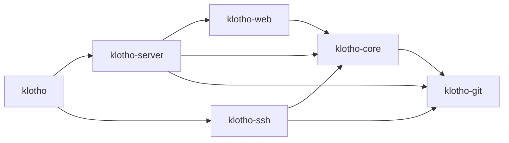

# Klotho roadmap

This is the build plan for Klotho: the packages to use, how to lay out the repository, and the order to build things in. Each phase has a goal, what to build, the requirements it satisfies, the new packages it brings in, a **Done when** checklist you can test, and notes on the traps to watch for.

Background:
- [docs/README.md](docs/README.md): the index of requirements and research.
- [ADR 0001](docs/decisions/0001-stack.md): why the stack is what it is.
- [ADR 0002](docs/decisions/0002-topcoat-ui.md): why the UI is server-rendered with Topcoat (replaces the SvelteKit SPA).
- [API endpoints](docs/design/api-endpoints.md) and [auth flows](docs/design/auth-flows.md): the designs the phases implement.

Versions are the latest at the time of writing (2026-09-30). Check crates.io (and the Mermaid release) when you add each one.

---

## 1. Repository layout

The target layout, reached during Phase 0:

```text
klotho/
├── Cargo.toml                  # workspace only: [workspace], shared deps and lints, no [package]
├── Cargo.lock
├── README.md  ROADMAP.md  LICENSE
├── klotho.example.toml         # every config key, with defaults and comments (NFR-OPS-013)
├── deny.toml                   # cargo-deny: licences and vulnerable crates (NFR-SEC-051)
│
├── crates/
│   ├── klotho/                 # the binary. main.rs + CLI (clap): `klotho serve`, `klotho admin …`
│   ├── server/                 # klotho-server. HTTP: the outer axum app. Mounts klotho-web as its fallback
│   │   └── src/
│   │       ├── lib.rs          #   build_app(state) -> Router
│   │       ├── api/            #   /api/v1 handlers, one module per area (repos.rs, user.rs…)
│   │       ├── oauth.rs        #   /-/oauth provider endpoints (Phase 8)
│   │       ├── git_http.rs     #   smart HTTP (today's src/smart_http.rs)
│   │       ├── assets.rs       #   /-/assets/*: the embedded Topcoat bundle (FR-UI-052)
│   │       ├── bearer.rs       #   Authorization: Bearer -> Actor extractor (the API's only auth)
│   │       └── error.rs        #   ApiError -> JSON {code, message} (FR-API-030)
│   ├── web/                    # klotho-web. The web UI: Topcoat pages and components, rendered on the server
│   │   ├── src/
│   │   │   ├── lib.rs          #   router(state) -> topcoat Router (app context, sessions, assets)
│   │   │   ├── app/            #   pages; the module tree is the URL tree (Topcoat module routing)
│   │   │   ├── components/     #   Topcoat UI components (copied in, ours to edit) + our own
│   │   │   └── session.rs      #   current_user(cx), require_sudo(cx)
│   │   ├── assets/             #   vendored JS (mermaid.esm.min.mjs, passkey.js), icons, images
│   │   ├── styles.css          #   Tailwind entry + theme (written by `topcoat ui init`)
│   │   └── components.toml     #   which Topcoat UI components are installed
│   ├── core/                   # klotho-core. Domain and data: no HTTP in here
│   │   ├── src/
│   │   │   ├── names.rs        #   RepoName / OwnerName: display + key (today's git/src/name.rs)
│   │   │   ├── authz.rs        #   authorize(actor, resource, action), the one permission check (FR-ACL-050)
│   │   │   ├── repos.rs        #   create / rename / delete services (DB + storage together)
│   │   │   ├── users.rs, auth/ #   passwords, tokens, passkeys, TOTP, OIDC logic
│   │   │   └── db/             #   sqlx queries
│   │   └── migrations/         #   sqlx migrations
│   ├── git/                    # klotho-git. Repositories on disk: gix reads, RepoStore, spawning upload-/receive-pack, hooks
│   └── ssh/                    # klotho-ssh. russh server that hands off to klotho-git (Phase 4)
│
├── xtask/                      # `cargo xtask dist`: the two-pass release build (ADR 0002)
│
├── tests/                      # end-to-end tests: start the real binary, run real `git clone/push`
└── docs/
```

Folders are short; package names keep the `klotho-` prefix. A bare `core` would clash with Rust's built-in `core` library, `git` is easily confused with the `git` program and `gix`, and generic names can collide with dependencies or on crates.io.

**Dependency direction.** Arrows point at what a crate may use. Never the other way.



- **`klotho-git` knows nothing about users, names or HTTP.** Once storage is ID-based (Phase 1), it takes a repository ID or path, never a name. That's why `name.rs` moves to `klotho-core`.
- **`klotho-core` knows nothing about HTTP.** It returns domain errors, and `klotho-server` and `klotho-web` map them to status codes and pages. The SSH server reuses exactly the same `authorize()` and services.
- **`klotho-web` is the only crate that knows about Topcoat.** It gets everything through public `klotho-core` services, never through raw SQL or `klotho-git`. That keeps API parity possible (FR-API-004), and if we ever leave Topcoat, only this crate gets rewritten.
- **Why not more crates?** Splitting `klotho-core` into `-db` and `-auth` is easy later if compile times hurt. Six crates are enough to enforce the boundaries that matter.

**Moved from the original layout (done 2026-10-01):**

| Was | Now |
|---|---|
| `src/main.rs` | `crates/klotho/src/main.rs`. Building the router moved to `klotho_server::build_app` |
| `src/api.rs`, `src/error.rs` | `crates/server/src/api.rs`, `error.rs`. `api.rs` splits into `api/` modules as it grows |
| `src/smart_http.rs` | `crates/server/src/git_http.rs` |
| `git/` (crate `git`) | `crates/git/` (crate `klotho-git`) |
| `git/src/name.rs` | Still in `klotho-git`. Moves to `crates/core/src/names.rs` in Phase 1 |

---

## 2. Packages

### Backend (Rust)

| Crate | Version | Used for | Phase |
|---|---|---|---|
| `tokio` | 1.x (have) | Async runtime | — |
| `axum` | 0.8.9 (have) | HTTP routing | — |
| `tower-http` | 0.7.1 | Middleware: `TraceLayer`, `TimeoutLayer`, `RequestBodyLimitLayer`, request IDs, compression | P0 |
| `tracing`, `tracing-subscriber` | (have) | Logging; turn on the `json` feature in P10 | — |
| `clap` | 4.6.7 | CLI (`serve`, `admin …`) | P0 |
| `figment` | 0.10.19 | TOML config with environment overrides (features `toml`, `env`) | P0 |
| `serde`, `serde_json`, `thiserror`, `anyhow` | (have) | — | — |
| `gix` | 0.88.0 (have 0.87) | Reading repositories | — |
| `sqlx` | 0.9.0 | Database: `sqlite`, `runtime-tokio`, `macros`, `migrate` (PostgreSQL later) | P1 |
| `jiff` | 0.2.37 | Timestamps with UTC offsets, RFC 3339 output (FR-API-011) | P1 |
| `sha2` | 0.11.0 | Storage path hashes, token hashes | P1 |
| `tempfile` | 3.27.0 | Atomic repository creation: initialise in a temp dir, then rename (FR-STOR-005) | P1 |
| `argon2` | 0.6.0 | Password hashing | P2 |
| `rand` | 0.10.3 | Tokens (PATs, one-time tokens). Session tokens come from `topcoat::session` | P2 |
| `base64` | 0.23.1 | Base64url encoding of tokens | P2 |
| `crc32fast` | 1.5.2 | PAT checksum | P2 |
| `secrecy` | 0.10.3 | Keeps secrets out of `Debug` output and logs (NFR-OPS-023) | P2 |
| `utoipa`, `utoipa-axum` | 6.0.0, 0.3.0 | OpenAPI generated from handlers (FR-API-005), for external clients | P3 |
| `rust-embed` | 8.12.0 | Embedding the Topcoat asset bundle in the binary (feature `embed-assets`) | P3 |
| `mime_guess` | 2.0.5 | Content types for embedded assets | P3 |
| `comrak` | 0.55.0 | Markdown (GFM) → HTML | P3 |
| `ammonia` | 4.2.0 | HTML sanitising after comrak (NFR-SEC-011) | P3 |
| `syntect` | 5.3.0 | Server-side syntax highlighting (FR-UI-003) | P3 |
| `russh` | 0.63.3 | SSH server | P4 |
| `webauthn-rs` | **0.5.5** | Passkeys. Use the stable 0.5 line, not the `0.6.1-dev` pre-release | P5 |
| `totp-rs` | 6.0.0 | TOTP 2FA | P5 |
| `openidconnect` | 4.0.1 | SSO sign-in (brings in `oauth2` 5) | P5 |
| `lettre` | 0.11.23 | Email: magic links, resets, notifications | P5 |
| `chacha20poly1305` | 0.11.0 | Encrypting stored secrets such as TOTP seeds and client secrets (NFR-SEC-042) | P5 |
| `tower_governor` | 0.8.0 | Rate limiting (NFR-SEC-021), as an axum layer that also covers the UI | P5 |
| `reqwest` | 0.13.5 | Outgoing HTTP: webhooks, mirrors (with an SSRF-safe resolver) | P6 / P8 |
| `hmac` | 0.13.0 | Webhook signatures (FR-INT-002) | P8 |
| `metrics`, `metrics-exporter-prometheus` | 0.24.6, 0.18.3 | `/-/metrics` | P10 |
| `tantivy` | 0.26.2 | Code search (later) | later |
| `ldap3` | 0.12.1 | LDAP sign-in (nice-to-have) | later |

**Deliberately left out:**
- **`tower-sessions` + `tower-sessions-sqlx-store`.** `topcoat::session` already issues the cookie and hands us the token hash, and our own `sessions` table fits the design exactly (hashed IDs, sudo mode). Also, the store 0.15 still depends on sqlx 0.8, and linking two sqlx versions with SQLite fails to build.
- **`axum-extra` cookies.** The API is bearer-only, and Topcoat handles the UI's cookies.
- **`samael` (SAML).** It's at 0.0.x. Use an OIDC bridge instead (FR-AUTH-038).

### Frontend (`crates/web`, no npm)

| Package | Version | Used for | Phase |
|---|---|---|---|
| `topcoat` | **=0.9.0** (pinned) | Pages, components, sessions, cookies, origin check, assets. Features: default + `tailwind`, `ui`, `font-fontsource`. Also a `[build-dependencies]` entry with `tailwind` | P2 (login page), P3 |
| Mermaid | 12.0.0 | `mermaid.esm.min.mjs` from the npm tarball's `dist/`, vendored in `assets/` and declared with `asset!()`. Loaded only on diagram pages | P8 |
| Passkey script | ours | About 50 lines around `navigator.credentials` with `PublicKeyCredential.parse*OptionsFromJSON()`. Replaces `@simplewebauthn/browser` | P5 |
| CodeMirror | — | Only if P9 needs an editor; the diff and code views are server-rendered with `syntect`. P9 decides how to bundle it | P9 |

Styling is Tailwind (through Topcoat, no Node) with Topcoat UI components copied in by `topcoat ui add`. Once copied they're our code: edit them freely.

**Upgrading Topcoat.** It's experimental and makes breaking changes. Upgrade one minor version at a time, in its own PR, and read the changelog first. The origin-check test and the asset manifest check in CI exist to catch silent breakage.

### Tools

| Tool | Install | Why |
|---|---|---|
| `sqlx-cli` | `cargo install sqlx-cli --no-default-features --features sqlite` | `sqlx migrate add`, and `cargo sqlx prepare` for offline query checking in CI |
| `cargo-deny` | `cargo install cargo-deny` | Licence and security checks in CI |
| `bacon` | `cargo install bacon` | Re-runs check, test or clippy on every save |
| `topcoat-cli` | `cargo install topcoat-cli` | `topcoat dev` (rebuild and re-bundle on save), `topcoat asset bundle`, `topcoat ui add`, `topcoat fmt` for `view!` blocks |

---

## 3. Phases

Phases run in order. The first milestone that matters is **after Phase 5: good enough for a small team to use for real.** Everything after that adds breadth.

### Phase 0: Groundwork

**Goal:** restructure, and fix the things that are cheap now and painful later.

- ~~Move to the workspace layout above, and rename crate `git` → `klotho-git`.~~ Done.
- Config: a `figment` TOML file plus `KLOTHO_…` environment overrides, with `#[serde(deny_unknown_fields)]`. Ship `klotho.example.toml`.
- CLI with `clap`: `klotho serve`, and an empty `klotho admin` for later.
- Graceful shutdown: `axum::serve(...).with_graceful_shutdown(signal)`, with a grace period for in-flight pushes.
- A git version check at startup (`git --version` ≥ your minimum; 2.39 is a sensible floor).
- `tower-http` layers: tracing, request IDs, timeouts on non-git routes, a body limit on `/api`.
- `/-/health`.
- CI (GitHub Actions or, later, Lachesis): `cargo fmt --check`, `clippy -D warnings`, `cargo test`, `cargo deny check`.
- **Topcoat spike:** an empty `klotho-web` with one "hello" page, mounted as axum's fallback, and `cargo xtask dist` producing one binary that serves its CSS from `/-/assets/` with no `assets/` directory next to it. This proves the two-pass build (ADR 0002) before anything depends on it.

**Requirements:** NFR-OPS-003, 010, 011, 012, 022 (health), 030; NFR-SEC-020 (partly).

**Done when:**
- [ ] `cargo test` passes from the workspace root and covers all crates.
- [ ] A config file with a typo'd key refuses to start and names the key.
- [ ] Ctrl-C during a large `git push` lets the push finish.
- [ ] Starting with a missing or too-old `git` prints a clear error and exits non-zero.
- [ ] The `cargo xtask dist` binary, copied alone to an empty directory, serves the hello page with its stylesheet, and the CI manifest check passes.

> **Guide notes.**
> - Do the restructure in one commit with no behaviour changes, so `git log --follow` stays useful.
> - Grace period: `with_graceful_shutdown` only stops *accepting* connections. The spawned `git` children also need tracking (a `JoinSet` or a counter) so you wait for them.

### Phase 1: Metadata store and repository identity

**Goal:** repositories get real identities. This fixes most naming and storage conflicts.

- SQLite via `sqlx`, migrations embedded with `sqlx::migrate!()`, and `/-/ready`.
- Tables: `users` (minimal, since owners need to exist), `repositories` (`id`, `owner_id`, `name`, `name_key`, `created_at`), and `repo_redirects` (created now, used in Phase 6).
- `names.rs` in `klotho-core`: `RepoName` keeps the display form and derives the key. Two parsers: `parse_new()` rejects the `.git`, `.wiki`, `.atom` and `.rss` suffixes; `parse_lookup()` strips one `.git`.
- ID-based storage in `klotho-git`: `<root>/<h[0:2]>/<h[2:4]>/<h>.git` with `h = hex(sha256(id))`.
- Atomic create: DB insert (the unique index on `(owner_id, name_key)` rejects duplicates) → `gix::init_bare` in a `tempfile::TempDir` inside the storage root → `rename` into place → commit the transaction.
- Owner-scoped routes: `/{owner}/{repo}` for git, and `/api/v1/repos/{owner}/{repo}` for the existing read endpoints.
- `klotho admin adopt` and `GET /api/v1/admin/unadopted` for existing `gitRepos/*.git` directories.

**Requirements:** FR-NAME-001–008, 010–012, 020–022, 030, 031, 040, 041; FR-STOR-001, 003–008, 010, 020; FR-REPO-001 (without auth), 002, 035.

**Done when:**
- [ ] Creating `MyRepo` returns `"name": "MyRepo"`, and cloning `myrepo.git` works.
- [ ] 50 parallel `POST`s of the same name: exactly 1 succeeds, 49 get `409`, and no stray directories are left.
- [ ] `con`, `nul`, etc. clone fine on Windows, because the path is a hash.
- [ ] `demo.git` as a new name gets `400`.
- [ ] An existing repository from the old `gitRepos/` can be adopted and cloned.

> **Guide notes.**
> - **SQLite first, PostgreSQL later.** sqlx's compile-time-checked macros (`query!`) check against *one* database, so supporting both from day one means writing untyped queries. Build on SQLite with `query!`. Add PostgreSQL later (FR-STOR-002 is should-have) with its own migrations directory, once the schema has settled.
> - Turn on SQLite's WAL mode and `foreign_keys=ON` at connect time.
> - Run `cargo sqlx prepare` so CI can build without a database.

### Phase 2: Accounts and access control

**Goal:** close the critical conflict. Nobody can push without permission.

- Users and registration modes, with the first admin created by `klotho admin create-user --admin` (FR-AUTH-003).
- Passwords (Argon2id), the `sessions` table, and `topcoat::session` for the `__Host-` cookie. Login, register and logout pages in `klotho-web` (plain forms, no JavaScript needed).
- Topcoat's origin check, plus a test that keeps it on, as in [auth-flows.md](docs/design/auth-flows.md). The API ignores the cookie and accepts bearer tokens only.
- Personal access tokens: format, SHA-256 storage, scopes.
- Git HTTP Basic auth with the `401` challenge.
- `authorize(actor, repo, action)` in `klotho-core`, used by **every** handler.
- Visibility public/private, with 404 for no access.
- Rename the API to `/api/v1`, and add `/user`, `/user/tokens` (list and revoke) and `/instance`. Token creation is the `/-/settings/tokens` page.

**Requirements:** FR-AUTH-001–003, 010–013, 020, 022, 023, 040, 041, 045; FR-ACL-001, 003, 004, 007, 010, 011, 013, 030, 050; FR-REPO-010; NFR-SEC-013.

**Done when:**
- [ ] Anonymous `git push` gets a credential prompt, and a wrong token is rejected.
- [ ] A private repository gives an identical `404` to a stranger and for a repository that doesn't exist.
- [ ] A form `POST` with the session cookie but `Sec-Fetch-Site: cross-site` gets `403`.
- [ ] A request to `/api/v1/user` with only the session cookie gets `401`.
- [ ] A token without `repo:write` can clone but not push.

> **Guide notes.**
> - Write `authorize()` as a pure function over `(actor, repo_facts, action)` and unit-test it with a table of cases. It's the single most important function in Klotho.
> - Make "no access" and "not found" the same error variant *inside* core, so a handler can't accidentally tell them apart.

### Phase 3: API v1 and the web app

**Goal:** a usable browsing UI, and the read API to match it.

- `klotho-core` services for every read: contents, raw, commits (cursor pagination), branches, tags, readme, ref resolving, search. Pages and API handlers both call these.
- Every read endpoint from [api-endpoints.md](docs/design/api-endpoints.md) (Phase P3 rows), with `raw` streamed with `nosniff`, and RFC 3339 times.
- `utoipa` annotations → `/api/v1/openapi.json`.
- `klotho-web` pages: dashboard, explore, profile, repository home, tree, file, commits, commit. Run `topcoat ui init`, then `topcoat ui add` for the components you need.
- Error pages: HTML 404 (identical for "doesn't exist" and "not visible") and 500. Per-page `<title>` and Open Graph tags.
- Slow parts (last commit per tree entry) go behind `suspense` so the page streams.

**Requirements:** FR-API-001–005, 010–012, 020–022, 030; FR-UI-001–003, 005, 007, 010, 020, 023, 050–052; NFR-UI-002; NFR-PERF-012–015; NFR-SEC-010, 011.

**Done when:**
- [ ] `cargo xtask dist` produces one binary that serves the whole UI, with no other files next to it.
- [ ] With JavaScript disabled, you can browse a repository, open files and read history.
- [ ] Downloading a 1 GiB file through `raw` doesn't grow server memory.
- [ ] `/api/v1/nope` returns JSON 404, and `/someone/something` returns the HTML 404 page with status 404.
- [ ] Every page action added in this phase has a matching API endpoint (check the P3 rows).

> **Guide notes.**
> - Topcoat reserves `/_topcoat/…`. That name is reserved in FR-NAME-032, so enforce it in `names.rs`.
> - Keep pages thin: a page calls `current_user(cx)`, then one or two `klotho-core` services, then renders. If a page wants a query that no service offers, add the service, and the API endpoint with it.
> - `view!` blocks get long. Run `topcoat fmt`, and split components early.
> - In development, run `topcoat dev`. It rebuilds, re-bundles assets and restarts the server on every save.

### Phase 4: Git hardening and data safety

**Goal:** safe to expose to a network.

- SSH server (`russh`), user SSH keys, deploy keys.
- Push hooks: a `pre-receive` / `post-receive` hook script in each repository that calls back into Klotho over a local socket or HTTP with a per-process secret. Alternatively, run `receive-pack` with `-c core.hooksPath=<klotho-managed dir>`.
- A push event table, recorded by post-receive (it feeds the thread view later).
- Git subprocess limits: a concurrency semaphore, `kill_on_drop(true)`, a timeout, a minimal environment. A push size limit.
- Repository config at creation: `core.fsync=committed`, `receive.fsckObjects=true`.
- Archive downloads.
- Backup and restore (`klotho admin backup` / `restore`), with a test that round-trips them.

**Requirements:** FR-GIT-002, 003, 012, 020–022, 024; FR-AUTH-014, 015; FR-ACL-020; NFR-SEC-020, 022, 023, 041; NFR-STOR-001, 002, 010; FR-STOR-040, 041.

**Done when:**
- [ ] `git clone git@host:owner/repo.git` works with a registered key, and is refused with an unknown one.
- [ ] 200 simultaneous clones: none fail, and the number of running `git` processes stays at or below the cap.
- [ ] Killing a clone client leaves no orphan `git` process.
- [ ] Backup → wipe → restore gives identical refs in every repository.

> **Guide notes.**
> - Hooks are the fiddliest part of Klotho. Gitea runs `gitea hook pre-receive`, a subcommand of its own binary, as the hook. Do the same: `klotho hook pre-receive`, which talks to the running server. Then the hook never needs its own config or database access.

### Phase 5: Sign-in methods and SSO

**Goal:** modern sign-in.

- Passkeys (primary and as a second factor) with our own small passkey script, TOTP and recovery codes, the MFA ticket flow, and sudo mode (redirect to `/-/sudo`).
- Email (`lettre`): verification, password reset, magic links.
- OIDC providers, configured by an admin, with account linking rules.
- Throttling and rate limits, and the audit log.
- Session list and revoke.

**Requirements:** FR-AUTH-004–006, 016, 021, 030, 032, 033, 036, 037, 042–044; NFR-SEC-021, 042, 050.

**Done when:**
- [ ] A user can register a passkey, remove their password, and sign in with the passkey alone.
- [ ] A magic link works once, fails a second time, fails after 15 minutes, and survives a mail scanner (a `GET` of the link doesn't use it up).
- [ ] Sign-in through Keycloak (run it in Docker for tests) creates or links an account keyed by `iss` + `sub`.
- [ ] Deleting a repository without a recent re-authentication gets `sudo_required`.

**🎯 Milestone: usable by a small team.** Write the README's install section now (NFR-OPS-034).

### Phase 6: Repository management

Rename with redirects (including case-only renames), transfer, archive, soft delete and restore, fork, import, pull mirrors, compare, blame.

**Requirements:** FR-NAME-023, 024, 050–055; FR-REPO-003, 012–014, 020–024, 030, 031, 033; FR-UI-006, 008; NFR-SEC-031 (SSRF, needed for imports and mirrors).

### Phase 7: Organisations and protection

Organisations, teams, collaborators, protected branches (no force-push, required reviews and statuses), protected tags, and require-sign-in mode.

**Requirements:** FR-NAME-011 (orgs); FR-ACL-002, 005, 006, 012, 040–043, 051.

### Phase 8: Integrations and the Moirai

Webhooks (signed, retried, logged), commit statuses (Lachesis), deployments (Atropos), the thread view and commit graph with vendored Mermaid (the diagram source is rendered into the page on the server), and Klotho as an OAuth2/OIDC provider, so Lachesis and Atropos sign in through Klotho.

**Requirements:** FR-INT-001–006, 010–013; FR-UI-040–043; FR-AUTH-035; NFR-SEC-014.

### Phase 9: Collaboration

Pull requests (from branches and forks, with `refs/pull/*`), reviews, merge strategies, issues, labels, milestones, releases and notifications. This is the most UI-heavy phase. Diffs are server-rendered; live updates (new comments, review state) use `#[shard]` components. Decide here whether an editor (CodeMirror) is needed at all.

**Requirements:** FR-COLLAB-001–004, 010, 011, 013, 020–023, 030, 040–042; FR-GIT-024 (enforced for `refs/pull`).

### Phase 10: Operations polish

Prometheus metrics, JSON logs, housekeeping and `fsck` schedules, quotas, Git LFS, the container image and systemd unit, and PostgreSQL support.

**Requirements:** NFR-OPS-004, 020, 021; FR-STOR-002, 030, 031, 050; FR-GIT-030.

---

## 4. Working agreements

- **UI and API move together.** A PR that adds a UI action adds the API endpoint in the same PR, both calling the same `klotho-core` service (FR-API-004). Account security pages are the only exception.
- **Every change names the requirement IDs it implements**, in the commit message or PR description. When code and requirements disagree, update the requirement or file a conflict. Don't let them drift silently.
- **End-to-end tests use real git.** Anything touching transport or auth gets a test in `tests/` that runs the actual `git` program against the actual binary. Mocks won't catch protocol bugs.
- **Update the conflict tables.** When a phase fixes a conflict listed in `docs/requirements/*.md`, remove the row in the same PR.
