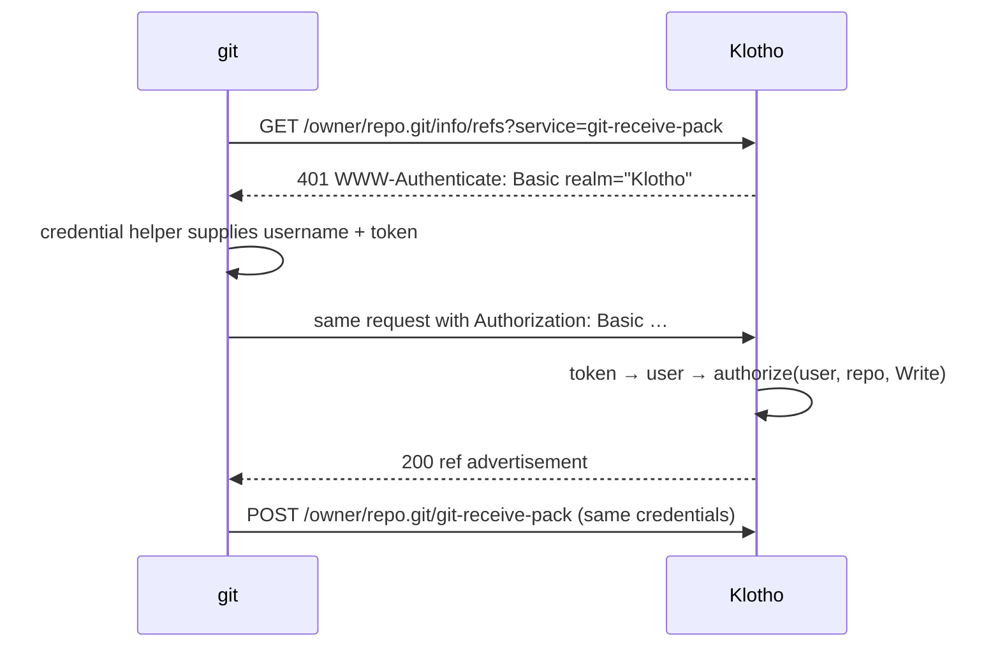

# Authentication flows

How Klotho signs people and tools in. This covers the credential model, sessions and CSRF for the web UI, each sign-in method (password, passkey, magic link, SSO), second factors, sudo mode, tokens, and git and SSH authentication.

- **What must be true:** [requirements/auth.md](../requirements/auth.md).
- **Endpoint shapes:** [api-endpoints.md](api-endpoints.md).

## Sign-in methods at a glance

| Method | Good for | Counts as | Requirement |
|---|---|---|---|
| Password | Everyone, as a fallback | 1st factor | FR-AUTH-010 |
| Passkey (WebAuthn, discoverable) | The default recommendation | 1st **and** 2nd factor (phishing-resistant, device-bound, user-verified) | FR-AUTH-016 |
| Magic link | Occasional users, no password to remember | 1st factor (proves control of the email address) | FR-AUTH-006 |
| SSO (OIDC) | Companies with Keycloak, Authentik, Entra ID, Google, GitLab | Whatever the identity provider enforced | FR-AUTH-030 |
| LDAP | Legacy directories | 1st factor | FR-AUTH-031 |
| SAML | Enterprises; run it through Keycloak/Authentik as OIDC | via the bridge | FR-AUTH-038 |
| TOTP / recovery code / security key | Second factor after a password or magic link | 2nd factor | FR-AUTH-032/033 |
| Personal access token | git over HTTP, API scripts, CI | Machine credential | FR-AUTH-011 |
| SSH key | git over SSH | Machine credential | FR-AUTH-014 |
| OAuth2 access token (Klotho as the provider) | Lachesis, Atropos, third-party apps | Delegated credential | FR-AUTH-035 |

**Policy: a passkey sign-in never asks for a second factor.** A passkey with user verification (PIN or biometrics) is already two factors. Asking again adds friction and no security.

## Data model

Tables in the metadata store. `*_hash` is SHA-256 for high-entropy random tokens and Argon2id for passwords.

| Table | Key columns | Notes |
|---|---|---|
| `users` | `id`, `username`, `username_key`, `password_hash?`, `is_admin`, `suspended_at?` | `password_hash` is nullable: passkey-only accounts have none |
| `emails` | `user_id`, `address`, `address_key`, `verified_at?`, `is_primary` | `address_key` = lowercased; unique |
| `sessions` | `id_hash`, `user_id`, `created_at`, `last_seen_at`, `sudo_until?`, `ip`, `user_agent` | The cookie holds the random ID; the database holds only its hash |
| `one_time_tokens` | `token_hash`, `purpose` (`magic_link` / `password_reset` / `email_verify` / `mfa_ticket` / `invite`), `user_id?`, `email?`, `expires_at`, `used_at?` | One table for every single-use token |
| `passkeys` | `id`, `user_id`, `credential` (serialised `webauthn-rs` Passkey), `name`, `created_at`, `last_used_at` | |
| `totp` | `user_id`, `secret_encrypted`, `confirmed_at?` | Encrypted with the server key (NFR-SEC-042) |
| `recovery_codes` | `user_id`, `code_hash`, `used_at?` | 10 codes |
| `external_identities` | `id`, `user_id`, `provider_id`, `issuer`, `subject` | **Unique on (`issuer`, `subject`)** (FR-AUTH-036) |
| `auth_providers` | `id`, `slug`, `issuer_url`, `client_id`, `client_secret_encrypted`, `allow_email_linking`, `allow_signup` | Configured by the admin |
| `access_tokens` | `id`, `user_id`, `name`, `token_hash`, `scopes`, `expires_at?`, `last_used_at?` | PATs |
| `ssh_keys` | `id`, `user_id?`, `repo_id?`, `fingerprint` (unique), `public_key`, `read_only` | A user key if `user_id` is set, a deploy key if `repo_id` is set |

## Sessions and CSRF (web UI)

**The cookie.** `__Host-klotho_session=<random 32 bytes>`, with `HttpOnly; Secure; SameSite=Lax; Path=/`. `topcoat::session` mints and sets it: `session::start` at sign-in, `rotate` on privilege changes, `stop` at sign-out ([ADR 0002](../decisions/0002-topcoat-ui.md)).
- `__Host-` rejects the cookie over plain HTTP. For local development over `http://localhost`, use a config flag to drop the prefix and `Secure`.
- Regenerate the ID at every sign-in and privilege change (FR-AUTH-045).

**Store.** Our own `sessions` table. Topcoat hands us the token's SHA-256 `TokenHash`, which becomes `id_hash`. A `current_user(cx)` function looks it up, checks expiry and suspension, and is called by every page that needs a user (Topcoat's "functions, not middlewares"). Server-side sessions can be listed and revoked (FR-AUTH-042). A stateless JWT session can't be revoked.

**The API ignores the cookie.** `/api/v1` accepts only `Authorization: Bearer` tokens, so the session cookie gives no authority there.

**Expiry** (FR-AUTH-041): 14 days idle and 90 days absolute by default. Update `last_seen_at` at most once a minute to keep database writes low.

**CSRF** (NFR-SEC-013). Only browser routes accept the cookie, so two layers are enough and no CSRF token is needed:
1. `SameSite=Lax`: browsers don't send the cookie on cross-site `POST`s.
2. Topcoat's origin check on every non-`GET` request: `Sec-Fetch-Site` must be `same-origin` (or `none`). If that header is absent (older browsers), the `Origin` header must equal the configured base URL. Add a test that a cross-site form `POST` gets `403`, so a Topcoat upgrade can't quietly turn the check off.

The API needs no CSRF protection, because browsers never attach bearer tokens automatically.

**Sudo mode** (FR-AUTH-044). `POST /auth/sudo` re-checks a password, passkey or TOTP and sets `sessions.sudo_until = now + 15 min`. Sensitive pages call `require_sudo(cx)`. Without a recent re-authentication, it redirects to `/-/sudo?return_to=<this page>`, and that page sends the user back once they've re-authenticated. The `POST` that triggered it is not replayed: the user lands back on the form and submits it again.

## Password sign-in (with an optional second factor)

1. The login form `POST`s `login` and `password` to `/-/login`.
2. The server finds the user by `username_key` or verified `address_key`. It **always** runs Argon2id verification, against a dummy hash if the user doesn't exist, so the response time doesn't reveal whether an account exists.
3. Failures count toward throttling per account and per IP (FR-AUTH-043).
4. If the user has no second factor, create the session and redirect (`303`) to `return_to`.
5. If they do, create an `mfa_ticket` one-time token (5 minutes), put it in a short-lived `__Host-` cookie, and redirect to `/-/login/mfa`. That page offers the user's methods (TOTP, security key, recovery code). Its `POST` checks the ticket and the code or WebAuthn assertion, and creates the session.

**Argon2id parameters:** use the `argon2` crate's defaults (the OWASP minimum is m=19 MiB, t=2, p=1). Store the PHC string so parameters can be raised later; rehash when someone signs in successfully with outdated parameters.

## Passkey sign-in (passwordless)

1. The login page's passkey script calls `POST /-/auth/passkey/options`. The server calls `webauthn-rs` `start_discoverable_authentication()`, stores the state server-side (a short-lived row or the pre-auth session), and returns the challenge.
2. The script turns the JSON into WebAuthn options with `PublicKeyCredential.parseRequestOptionsFromJSON()` and calls `navigator.credentials.get()`. Use **conditional UI** (`mediation: "conditional"`) so passkeys appear in the username field's autofill. This is about 50 lines of our own JavaScript, vendored as an asset; there's no npm package.
3. The script sends `credential.toJSON()` to `POST /-/auth/passkey/verify`. The server finds the credential by the user handle, verifies it, updates the signature counter and creates the session.

**Configuration.** WebAuthn binds credentials to the **relying-party ID**, the domain from the configured base URL. Changing the domain later invalidates every passkey, so warn about this in the configuration docs.

## Magic link

```mermaid
sequenceDiagram
    participant B as Browser
    participant K as Klotho
    participant M as Mailbox
    B->>K: POST /-/auth/magic-link (form: email)
    K->>K: throttle; if verified email exists → create one_time_token (15 min, hash stored)
    K-->>B: "Check your email" page (same whether or not the email exists)
    K->>M: email: https://host/-/auth/magic?token=…
    M->>B: user clicks the link
    B->>K: GET /-/auth/magic?token=…
    K-->>B: "Sign in as …?" page with a form (token in a hidden field). The GET doesn't use the token, so a mail scanner can't.
    B->>K: POST /-/auth/magic (form: token)
    K->>K: hash → find unused, unexpired token → mark used
    alt user has a second factor
        K-->>B: 303 to /-/login/mfa (ticket cookie)
    else
        K-->>B: session cookie + 303 to the dashboard
    end
```

Rules (FR-AUTH-006):
- **Single use.** Mark the token used in the same transaction that looks it up, e.g. `UPDATE … SET used_at = now() WHERE token_hash = ? AND used_at IS NULL AND expires_at > now()`, and check that exactly one row changed. This makes it safe against double clicks.
- **Only verified addresses** get links. Unknown addresses get nothing (or an optional "someone tried to sign in" email), but the page shown is identical.
- **Other devices are fine.** Links can be opened on a different device from the one that asked. That's convenient but phishable ("click this link I sent you"). A later hardening option: when the link opens on a different browser, show a 6-digit code that must be typed on the requesting device.
- **Throttling:** at most 3 links per address per 15 minutes.

- **Keep the token out of logs.** It's in the query string, so the tracing layer redacts query strings on `/-/auth/*`, and these pages send `Referrer-Policy: no-referrer`.

Password reset and email verification use the same `one_time_tokens` table and the same confirm-then-`POST` pattern.

## SSO with OpenID Connect

```mermaid
sequenceDiagram
    participant B as Browser
    participant K as Klotho
    participant I as Identity provider
    B->>K: GET /-/auth/oidc/{provider}/start?return_to=/owner/repo
    K->>K: generate state, nonce, PKCE verifier → store in a short-lived login row
    K-->>B: 302 to the IdP authorize URL (code_challenge, state, nonce)
    B->>I: sign in (the IdP handles its own MFA)
    I-->>B: 302 /-/auth/oidc/{provider}/callback?code&state
    B->>K: callback
    K->>K: check state; exchange code + PKCE verifier; validate ID token (sig, iss, aud, exp, nonce)
    K->>K: find external_identities by (iss, sub)
    alt found
        K->>K: create session for that user
    else not found, email_verified && provider.allow_email_linking && matching verified email
        K->>K: link identity to that user, create session
    else not found, provider.allow_signup
        K->>K: create user (pick username), link, create session
    else
        K-->>B: redirect to login with "no account linked to this identity"
    end
    K-->>B: 302 to return_to (validated as a same-origin relative path)
```

Notes:
- **Use the `openidconnect` crate.** It does discovery, PKCE, nonce and ID-token validation, so none of this is hand-rolled (FR-AUTH-037).
- **Validate `return_to`.** It must be a relative path starting with a single `/`, not `//`. Otherwise the callback becomes an open redirect.
- **Two providers need special handling.** GitHub is OAuth2, not OIDC: it has no ID token, and identity comes from `GET /user`. Its `id` is stable, so use `issuer = "https://github.com"` and `subject = id`. Microsoft Entra ID multi-tenant apps put the tenant in `iss`, so treat each tenant as a different issuer.
- **MFA after SSO.** By default, trust the identity provider's MFA. An admin setting per provider, "require Klotho 2FA after SSO", covers providers that don't enforce it.
- **Deprovisioning.** Without SCIM (FR-AUTH-039), a person removed at the identity provider keeps their Klotho sessions and tokens until they expire. Document this, and let admins suspend users.

## Git over HTTP



**Who gets challenged:**
- `git-receive-pack`, and anything on a private repository, gets a `401` challenge when no credentials are sent (FR-AUTH-023).
- Anonymous `git-upload-pack` on a public repository is simply served.
- A private repository the caller can't read gets `404` (FR-ACL-013). Send the `401` challenge first when the request is anonymous, so git asks for credentials.

**Credentials.** The username is informational; the password field carries the token (GitHub works the same way). Account passwords are rejected by default (FR-AUTH-021).

**Performance.** Every git request carries the credentials, and one clone makes 2–3 requests. Token lookup must be one indexed query on `token_hash`. That's why tokens use SHA-256 and not Argon2: they're high-entropy, so a slow hash adds nothing.

## Git over SSH

1. `russh` server, public-key auth only. Look the offered key's SHA-256 fingerprint up in `ssh_keys`; the result is a user key or a deploy key.
2. Accept only `exec` requests. Parse the command strictly: exactly `git-upload-pack '<path>'` or `git-receive-pack '<path>'` (also `git-upload-archive`). Resolve `<path>` as a repository name the same way HTTP does, then run the same `authorize()` call (FR-ACL-050).
3. Hand the channel to Klotho's protocol engine (`klotho_git::protocol`, [ADR 0004](../decisions/0004-native-git-transport.md)) in its stateful mode, with the protocol version from the client's `GIT_PROTOCOL` environment request (protocol v2). No process is started.
4. Reject shell, PTY and port-forwarding requests with a friendly message: "Hi <user>! You've authenticated, but Klotho doesn't provide shell access."

## Personal access tokens

- **Format:** `klotho_pat_` + 30 random base62 characters + a 6-character CRC32 checksum. The prefix lets secret scanners find leaked tokens, and the checksum lets Klotho reject typos without a database lookup (the same scheme as GitHub). See FR-AUTH-013.
- **Shown once** at creation. Only the SHA-256 hash is stored (FR-AUTH-012).
- **Effective permissions** = the token's scopes ∩ the owner's current permissions (FR-ACL-030).
- **Scopes (initial set):**
  - `repo:read`, `repo:write`, `repo:admin`
  - `user:read`, `user:write`
  - `org:read`, `org:admin`
  - `status:write`: lets CI (Lachesis) report statuses without push access
  - `admin`
- **Last used:** update `last_used_at` at most hourly, and show it in the UI so stale tokens are easy to spot.

## Throttling (FR-AUTH-043)

Count in the database or in memory, keyed per account and per IP:

| Endpoint | Limit |
|---|---|
| Password and MFA sign-in | 10 failures per account per 15 min → growing delay; 50 per IP per 15 min → `429` |
| Magic link / password reset request | 3 per address per 15 min, 20 per IP per hour |
| Token authentication on git/API | Failed attempts count per IP; `429` after 100 failures per 5 min |

## Implementation order

This matches the roadmap:
1. **P2:** users, passwords, sessions (`topcoat::session` + our table), the origin-check test, PATs, git HTTP Basic, `authorize()`.
2. **P4:** SSH keys and deploy keys, together with the SSH server.
3. **P5:** passkeys, TOTP and recovery codes, magic links, password reset, email verification, OIDC, sudo mode, throttling, audit log.
4. **P8:** Klotho as an OAuth2/OIDC provider, and the device flow.
